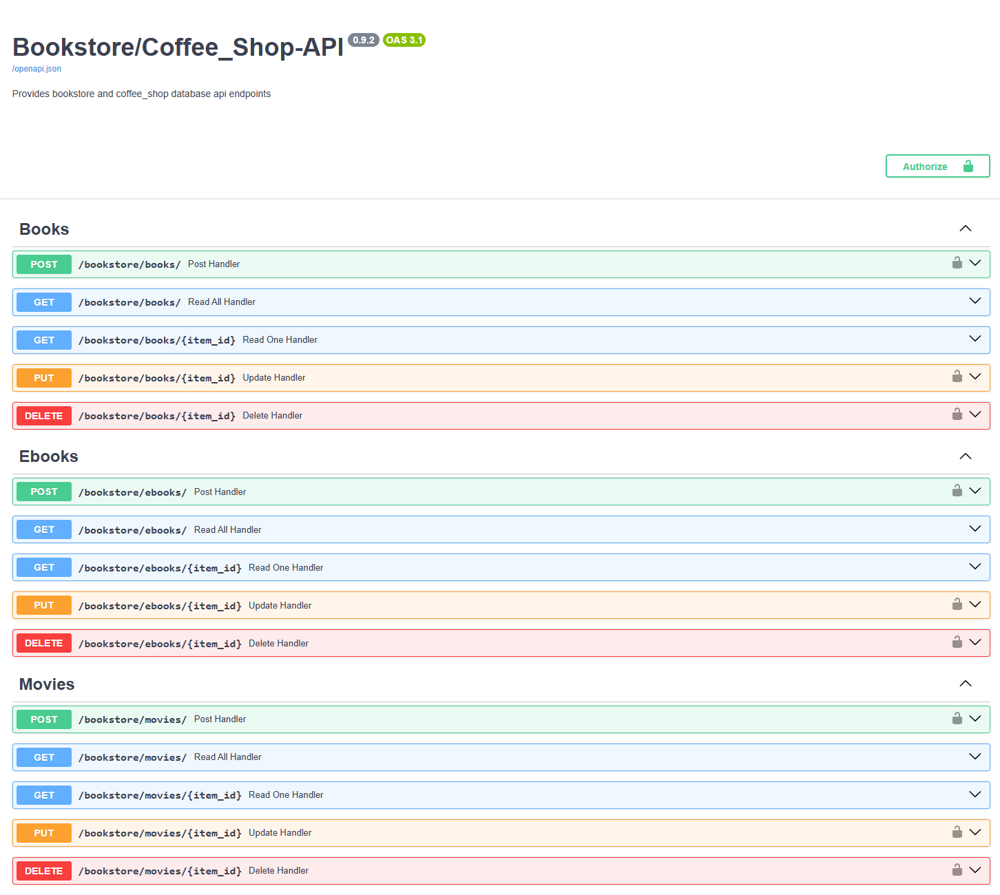
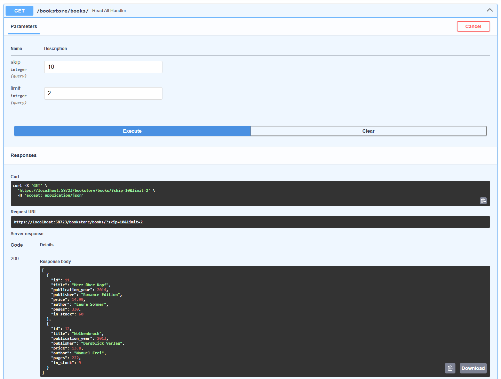

> ⚠️ Dieses Projekt dient ausschließlich zu Lern- und Demonstrationszwecken.


# Praxisprojekt_04A_Buchhandlung_mit_Cafe

Eine RESTful API für einen Buchladen mit integriertem Café.
Dieses Projekt dient als Praxis- und Lernprojekt zur Entwicklung
moderner API- und Datenbankanwendungen mit Python.

---

## Projektbeschreibung

Die Anwendung simuliert die Backend-Struktur eines Buchladens mit Cafébetrieb.
Sie stellt eine REST-API bereit zur Verwaltung von:

-   Büchern
-   Café-Produkten
-   Bestellungen

Das Projekt wurde entwickelt, um den praktischen Umgang mit folgenden Themen zu trainieren: 

-   REST-Architektur 
-   Datenbankdesign 
-   Authentifizierung (Datenbank-Login, Token)
-   Docker-Containerisierung

---

## Screenshots

### API-Dokumentation (Swagger UI)



### Datenbankstruktur (ER-Diagramm)

Buchladen DB: <br>


Café DB: <br>


### Beispiel einer API-Antwort

  

---

## Features

-   Authentifizierung (DB User, Passwort, Token)
-   CRUD-Operationen für Bücher
-   CRUD-Operationen für Café-Produkte
-   Logging von Änderungen in der Datenbank
-   PostgreSQL-Datenbankanbindung
-   Docker-Unterstützung
-   Automatische API-Dokumentation (Swagger & ReDoc)

---

## Technologien

-   Python
-   FastAPI
-   PostgreSQL
-   SQLAlchemy
-   Pydantic
-   Docker
-   Uvicorn

---

## Projektstruktur

```text
.
├── api_test.ipynb
├── auth.py
├── database.py
├── main.py
├── README.md
├── requirements.txt
├── docker/
├── models/
├── schemas/
├── routers/
└── sql/
    ├── init_all.sh
    └── data/
        └── secret/
            ├── .env
            ├── cert.pem
            ├── example_token.env
            ├── example.env
            ├── key.pem
            └── token.env
```

| Datei/Ordner        | Beschreibung |
|---------------------|--------------|
| `api_test.ipynb`    | Notebook zum Testen der API |
| `auth.py`           | Authentifizierungslogik |
| `database.py`       | Datenbankverbindung |
| `main.py`           | Einstiegspunkt der Anwendung |
| `docker/`           | Docker-Konfiguration |
| `models/`           | SQLAlchemy-Modelle |
| `schemas/`          | Pydantic-Schemas |
| `routers/`          | API-Routen |
| `sql/`              | DB-Initialisierung |
| `sql/data/secret/`  | SSL-Zertifikate (optional), Umgebungsvariablen |

---

## Voraussetzungen

-   Python 3.11+
-   PostgreSQL 15+
-   Docker & Docker Compose (optional)

---

## Umgebungsvariablen

Folgende Variablen werden benötigt:

### .env

| Variable | Beschreibung |
|----------|--------------|
| `POSTGRES_DB_USER` | Postgres DB Benutzer |
| `POSTGRES_DB_PASSWORD` | Postgres DB Passwort |
| `POSTGRES_DB_PORT` | Port des Postgres Servers (5432) |
| `POSTGRES_DB_NAME` | Name der Postgres Datenbank |
| `BOOKSTORE_DB_USER` | Buchladen DB Benutzer |
| `BOOKSTORE_DB_PASSWORD` | Buchladen DB Passwort |
| `BOOKSTORE_DB_HOST` | IP-Adresse der Buchladen DB |
| `BOOKSTORE_DB_PORT` | Port der Buchladen DB (5432) |
| `BOOKSTORE_DB_NAME` | Name der Buchladen DB |
| `COFFEE_SHOP_DB_USER` | Café DB Benutzer |
| `COFFEE_SHOP_DB_PASSWORD` | Café DB Passwort |
| `COFFEE_SHOP_DB_HOST` | IP-Adresse der Café DB |
| `COFFEE_SHOP_DB_PORT` | Port der Café DB (5432) |
| `COFFEE_SHOP_DB_NAME` | Name der Café DB |

### token.env

| Variable | Beschreibung |
|----------|--------------|
| `API_TOKEN` | Token zur Authentifizierung |

Die `example.env` und `example_token.env` Dateien können editiert und dann in `.env` bzw. `token.env` umbenannt werden.

---

## Installation & Ausführung

### Repository klonen

``` bash
git clone https://github.com/Pydatrick/Praxisprojekt_04A_Buchhandlung_mit_Cafe.git
cd Praxisprojekt_04A_Buchhandlung_mit_Cafe
```

### Virtuelle Umgebung erstellen

``` bash
python -m venv venv
venv\Scripts\activate   # Windows
source venv/bin/activate  # Linux/Mac
```

### Abhängigkeiten installieren

``` bash
pip install -r requirements.txt
```

### Mit Docker starten

Im Ordner `docker` diesen Befehl ausführen:
``` bash
docker-compose --env-file ../sql/data/secret/.env up -d
```

### Anwendung starten

``` bash
uvicorn main:app --reload
```
oder `main.py` starten.

---

## API-Dokumentation

Nach dem Start erreichbar unter:

-   Swagger UI: http://localhost:58723/docs

---